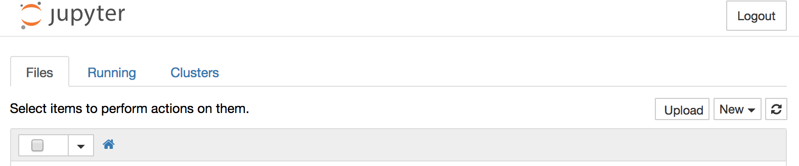

# Gator Bioinformatics

## Data Visualization in Python
## Fall 2017

## About this workshop
The workshop builds on the UF DSI Data Visualization workshops, adding new tools and focusing on bioinformatics data and analyses. It assumes basic familiarity with Python, but should be clear enough for new users too.

## Before the workshop

- For this workshop we will be using Anaconda Python. Please download and install Anaconda on your computer from [Anaconda Python Download Site](https://www.anaconda.com/download).
    - There are Mac, Windows and Linux versions
    - We will be using the Python 3.6. **Note that is different than the Python 2.7 used in the UF DSI workshops**. If you have 2.7, it would be best to install the 3.6 version for this workshop.

## Getting started
- On Mac and Linux:
    - Open the Terminal application (For Mac: /Applications/Utilities/Terminal)
    - Type `jupyter notebook` and hit return
    - Open your web browser and it should open a new window with the Notebook.
- On Windows:
    - Open Anaconda
    - Got to the Anaconda prompt
    - Type `jupyter notebook` and hit return
    - Open your web browser and it should open a new window with the Notebook.
- Should look like this:

- Click the New button and select Python 3.
- Continue with this workshop on the [jupyter page](jupyter.ipython)
-
